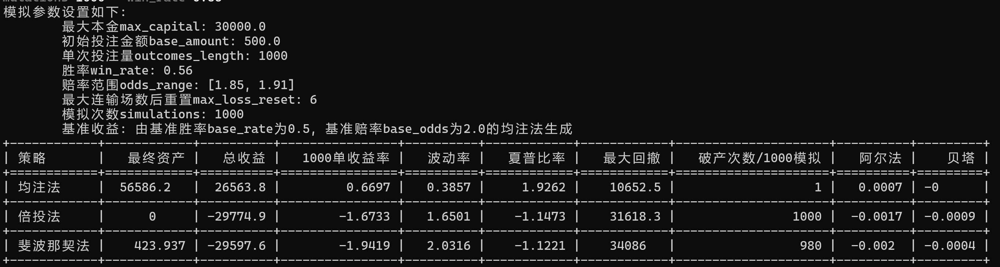

# 足球模拟投注程序

没什么好藏着掖着的，利用足球可以盈利，关键就是下面三条

## 利用足球盈利的关键

1. 均注法，怼量
2. 二选一的情况下，保持胜率在0.55以上
3. 赔率范围平均值和中位数保持在1.88左右，赔率极大值小、极小值越靠近1.88越稳定

使用：`python simulation.py -h`查看详细使用方法

效果如图所示

## 千万

不要使用任何倍投、费波纳奇投注方案，均注才是最好的。
